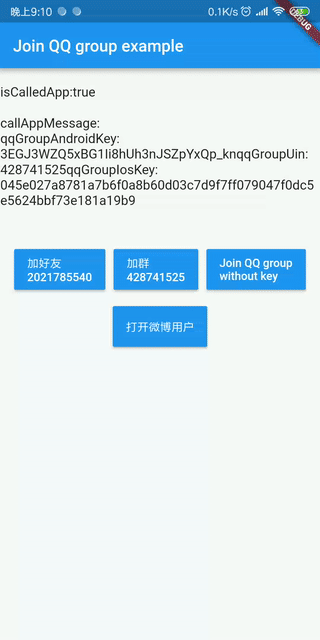
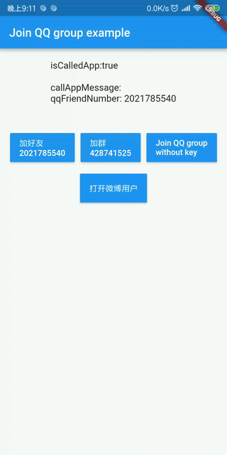
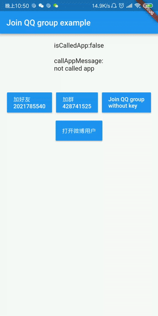

# nesp_sdk_flutter_social

A Flutter plugin for social.

支持群：428741525

[English](./README.md)

***
该插件支持iOS和Android
****

## 截图
>### 加QQ好友
>
> 

***

> ### 加QQ群
> 


***

> ### 错误调用示例
> #### (This is a case of error when calling)
> 

***

> ### 打开微博指定用户
> 

***

> ### 打开其他软件
> 

## 开始

### 安装
将下面的代码添加到包的 pubspec.yaml 文件中:

```yaml
dependencies:
  # Adds nesp_sdk_flutter_social to your project
  nesp_sdk_flutter_social: ^0.0.1
```

### 配置应用

将以下内容添加到适用于 iOS 的应用项目的 info.plist 文件中。

```xml
    <key>LSApplicationQueriesSchemes</key>
	<array>
        <!-- 微信 URL Scheme 白名单-->
        <string>wechat</string>
        <string>weixin</string>

        <!-- 新浪微博 URL Scheme 白名单-->
        <string>sinaweibohd</string>
        <string>sinaweibo</string>
        <string>sinaweibosso</string>
        <string>weibosdk</string>
        <string>weibosdk2.5</string>

        <!-- QQ、Qzone URL Scheme 白名单-->
        <string>mqqapi</string>
        <string>mqq</string>
        <string>mqqOpensdkSSoLogin</string>
        <string>mqqconnect</string>
        <string>mqqopensdkdataline</string>
        <string>mqqopensdkgrouptribeshare</string>
        <string>mqqopensdkfriend</string>
        <string>mqqopensdkapi</string>
        <string>mqqopensdkapiV2</string>
        <string>mqqopensdkapiV3</string>
        <string>mqzoneopensdk</string>
        <string>wtloginmqq</string>
        <string>wtloginmqq2</string>
        <string>mqqwpa</string>
        <string>mqzone</string>
        <string>mqzonev2</string>
        <string>mqzoneshare</string>
        <string>wtloginqzone</string>
        <string>mqzonewx</string>
        <string>mqzoneopensdkapiV2</string>
        <string>mqzoneopensdkapi19</string>
        <string>mqzoneopensdkapi</string>
        <string>mqzoneopensdk</string>

        <!-- 支付宝  URL Scheme 白名单-->
        <string>alipay</string>
        <string>alipayshare</string>

    </array>
```

将以下内容添加到适用于 Android 的应用项目的 AndroidManifest.xml 文件中。
```xml
<queries>
    <intent>
        <action android:name="android.intent.action.MAIN"/>
    </intent>
</queries>
```
## 功能

### 加好友

```dart
try {
      isSuccess = await NespSdkFlutterSocial.joinQQFriend(
        qqFriendNumber: "input your qq friend number",
      );
      
    } on PlatformException catch (e) {
      //do something 
    }
```

### 加QQ群

```dart

try {
   isSuccess = await NespSdkFlutterSocial.joinQQGroup(
        androidKey:  "input your android key",
        groupUin:  "input your group uin",
        iosKey: "input your ios key",
      );

    } on PlatformException catch (e) {
        //do something
    }

```

### 打开微博指定用户

```dart

try {
    isSuccess =  await NespSdkFlutterSocial.openWeiboUser(
        uid: “输入你要打开的用户ID”,//打开网页微博,鼠标放在头像下面的关注或粉丝时就能在右下方看见UID
      );
    } on PlatformException catch (e) {
     // do something
    }

```

### 打开其他应用
``` dart

try {
      isCalledOtherApp = await NespSdkFlutterSocial.openOtherApp(
        androidPackageName: "你要打开的应用包名",
        androidClassName: "你要打开的应用Activity的类名",
        iosAppUrl: "你要打开的IOS应用URL",
      );
    } on PlatformException catch (e) {
     //do something
    }

```
