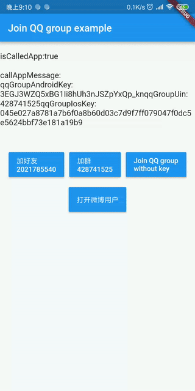
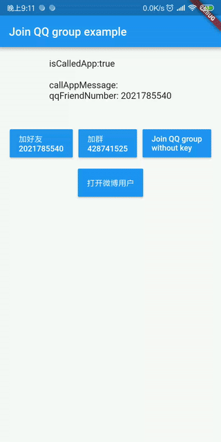
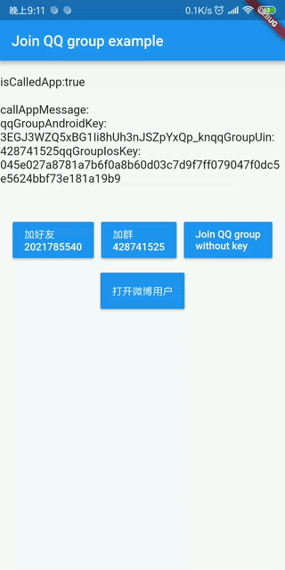
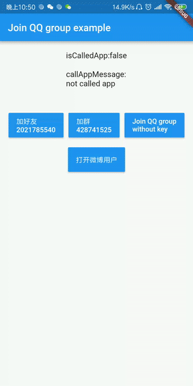
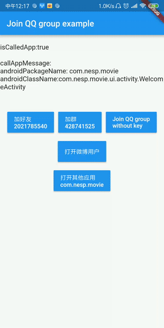

# nesp_sdk_flutter_social

A Flutter plugin for social.

Support QQ Group:428741525

[中文](./README-ZH-cn.md)

***
This plugin supports Android and iOS.

****

## Screenshots
>### Join QQ Friend
>
> 

***

> ### Join QQ Group
> 


***

> ### Join QQ Group no key
> #### (This is a case of error when calling)
> 

***

> ### Open Weibo User
> 

***

> ### Open Other App
> 

## Getting Started 

### Install
Add this to your package's pubspec.yaml file:

```yaml
dependencies:
  # Adds nesp_sdk_flutter_social to your project
  nesp_sdk_flutter_social: ^0.0.1
```

### Config App

Add the following to your app project's info.plist file for iOS.

```xml
    <key>LSApplicationQueriesSchemes</key>
	<array>
        <!-- 微信 URL Scheme 白名单-->
        <string>wechat</string>
        <string>weixin</string>

        <!-- 新浪微博 URL Scheme 白名单-->
        <string>sinaweibohd</string>
        <string>sinaweibo</string>
        <string>sinaweibosso</string>
        <string>weibosdk</string>
        <string>weibosdk2.5</string>

        <!-- QQ、Qzone URL Scheme 白名单-->
        <string>mqqapi</string>
        <string>mqq</string>
        <string>mqqOpensdkSSoLogin</string>
        <string>mqqconnect</string>
        <string>mqqopensdkdataline</string>
        <string>mqqopensdkgrouptribeshare</string>
        <string>mqqopensdkfriend</string>
        <string>mqqopensdkapi</string>
        <string>mqqopensdkapiV2</string>
        <string>mqqopensdkapiV3</string>
        <string>mqzoneopensdk</string>
        <string>wtloginmqq</string>
        <string>wtloginmqq2</string>
        <string>mqqwpa</string>
        <string>mqzone</string>
        <string>mqzonev2</string>
        <string>mqzoneshare</string>
        <string>wtloginqzone</string>
        <string>mqzonewx</string>
        <string>mqzoneopensdkapiV2</string>
        <string>mqzoneopensdkapi19</string>
        <string>mqzoneopensdkapi</string>
        <string>mqzoneopensdk</string>

        <!-- 支付宝  URL Scheme 白名单-->
        <string>alipay</string>
        <string>alipayshare</string>

    </array>
```

Add the following to your app project's AndroidManifest.xml file for Android.
```xml
<queries>
    <intent>
        <action android:name="android.intent.action.MAIN"/>
    </intent>
</queries>
```
## Features

### Join QQ Friend

```dart
try {
      isSuccess = await NespSdkFlutterSocial.joinQQFriend(
        qqFriendNumber: "input your qq friend number",
      );
      
    } on PlatformException catch (e) {
      //do something 
    }
```

### Join QQ Group

```dart
try {
   isSuccess = await NespSdkFlutterSocial.joinQQGroup(
        androidKey:  "input your android key",
        groupUin:  "input your group uin",
        iosKey: "input your ios key",
      );

    } on PlatformException catch (e) {
        //do something
    }
```

### Open Weibo User

```dart
try {
    isSuccess =  await NespSdkFlutterSocial.openWeiboUser(
        uid: “input your weibo user id”,
      );
    } on PlatformException catch (e) {
     // do something
    }
```

### Open Other App

``` dart
try {
      isCalledOtherApp = await NespSdkFlutterSocial.openOtherApp(
        androidPackageName: "input your android app package name",
        androidClassName: "input your android activity class name",
        iosAppUrl: "input your IOS APP URL",
      );
    } on PlatformException catch (e) {
     //do something
    }
```
